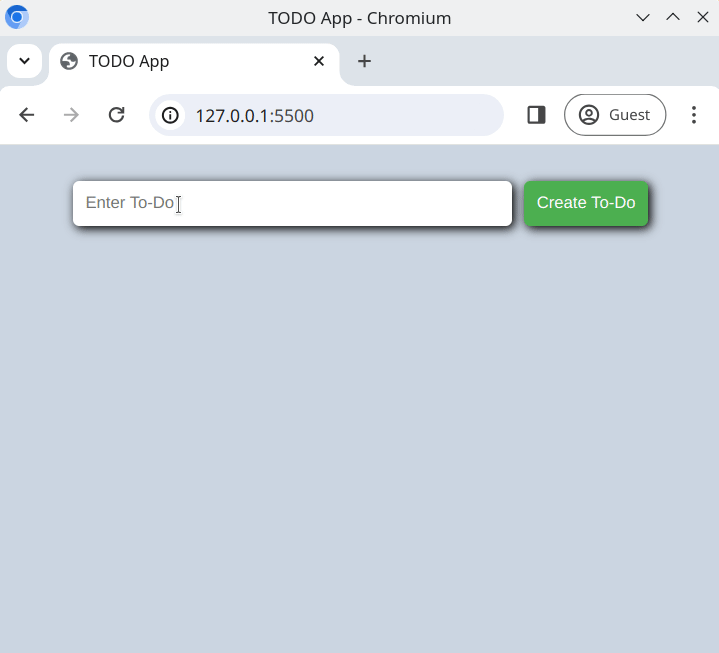

# ToDo List Application

The **ToDo List Application** is a simple yet functional project designed to help you understand the basics of DOM manipulation and event handling in JavaScript. This app allows users to manage a list of tasks with options to add, delete, and mark tasks as done.

## Features
- An input field to add new tasks.
- A button to add tasks to the list dynamically.
- A display of all added tasks with the following controls:
  - A **delete button** to remove tasks from the list.
  - A **done button** to toggle a strikethrough effect on completed tasks

## Technologies Used
- **HTML5**: Provides the structure of the application.
- **CSS3**: Styles the application for a clean and user-friendly interface.
- **JavaScript (ES6)**: Implements the logic and interactivity for the application.

## Example




## Getting Started
1. Clone the repository to your local machine:
   ```bash
   git clone <repository-url>
   ```

